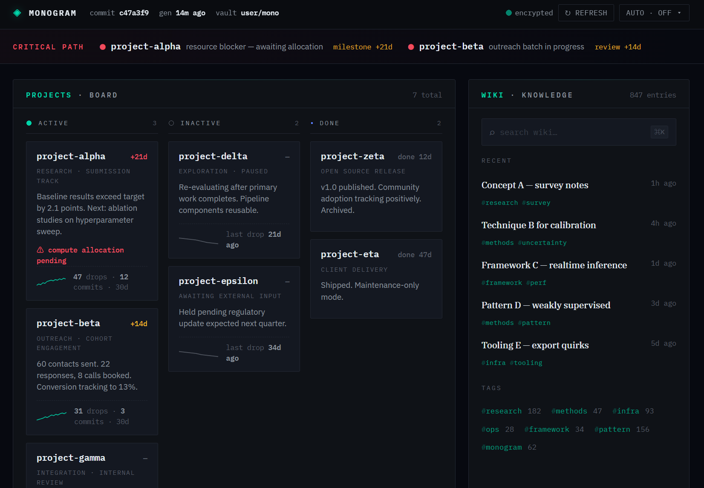

# Monogram

**Language:** [English](README.md) · [한국어](README.ko.md)

> Telegram 에 공유한 모든 것을 위키로, 모든 커밋을 칸반 프로젝트로, 대시보드로 한눈에 — 자동화된 파이프라인.

[](https://github.com/HarimxChoi/monogram/actions/workflows/tests.yml)
[](https://github.com/HarimxChoi/monogram/actions/workflows/eval.yml)
[](LICENSE)
[](https://www.python.org/downloads/)

커밋은 자동으로 칸반프로젝트가 되고, 공유한 링크는 위키가 되어 아침에
리포트가 도착합니다. 세가지 뷰로 확인 — Obsidian, 대시보드, MCP

Telegram 저장된 메세지에 뭐든 공유하면 (유튜브/인스타링크, 메모, PDF/word/hwp, 사진 등)
Monogram 이 5-stage LLM pipeline 으로 분류하고 구조화된 마크다운으로
private GitHub 레포에 한 커밋으로 원자적으로 기록합니다. 이 볼트는
GCP 위에 자동 생성·암호화된 대시보드로 렌더링됩니다.



다크, 정보 밀도 높은 UI, 비밀번호 보호, 클라이언트 사이드 복호화.
정적 버킷 (GCS 프리티어에서 월 $0), GCP 프리티어에 자동화된 호스팅
디자인 참고:
[docs/design/webui-mockup.html](docs/design/webui-mockup.html).

> 🎬 **30-second walkthrough** — 캡처 → 볼트 → 대시보드 → MCP 쿼리. *준비 중.*

<!--
  ┌─────────────────────────────────────────────────────────────┐
  │  SHORT SLOT — replace the blockquote above with:            │
  │                                                             │
  │  Option A (inline GIF, autoplays on GitHub, ≤5 MB):         │
  │         │
  │                                                             │
  │  Option B (clickable poster → YouTube Short):               │
  │    <a href="https://www.youtube.com/shorts/YOUR_ID">        │
  │               │
  │    </a>                                                     │
  │                                                             │
  │  Option C (both — GIF inline + link to full Short):         │
  │         │
  │                                                             │
  │    *Full walkthrough:                                       │
  │    [youtube.com/shorts/YOUR_ID](https://…)*                 │
  │                                                             │
  │  Target arc (15-30s):                                       │
  │    0-3s   phone: drop URL in Telegram Saved Messages        │
  │    3-10s  desktop: commit appears on GitHub                 │
  │   10-20s  browser: dashboard auto-updates with the drop     │
  │   20-30s  Claude Desktop: MCP query finds the same drop     │
  └─────────────────────────────────────────────────────────────┘
-->

## Architecture

```
┌──────────────────────────────────────────────────────────────┐
│  INPUTS                                                      │
│    Telegram Saved Messages  ·  Obsidian plugin  ·  MCP       │
└────────────────────────┬─────────────────────────────────────┘
                         ▼
┌──────────────────────────────────────────────────────────────┐
│  PIPELINE     (5 stages · per-stage latency logged)          │
│    Orchestrator → Classifier → Extractor                     │
│                           → Verifier → Writer                │
└────────────────────────┬─────────────────────────────────────┘
                         ▼
┌──────────────────────────────────────────────────────────────┐
│  VAULT  (git)                  BACKUP  (separate PAT)        │
│    <user>/mono          ⟶      <user>/mono-backup            │
└────────────────────────┬─────────────────────────────────────┘
                         │
       ┌─────────┬───────┴───────┬────────────┐
       ▼         ▼               ▼            ▼
   Morning    Weekly         Web UI       MCP server
    brief     rollup       (dashboard)  (Claude / Cursor)

┌──────────────────────────────────────────────────────────────┐
│  OBSERVABILITY         │  EVAL HARNESS       (optional)      │
│  log/pipeline.jsonl    │  cassette replay · harvest loop     │
│  /stats · CLI          │  3-layer kill-switch                │
└──────────────────────────────────────────────────────────────┘
```

여섯 개의 수평 레이어로 구성되어 있고, 입력 → 파이프라인 →
볼트/백업 → 소비자 surface 순으로 이어집니다. 관측성과 eval 은
아래에서 cross-cutting 으로 걸쳐 있습니다. 상세 문서:
[docs/architecture.md](docs/architecture.md).

## Quickstart

Python 3.10+, GitHub 계정, Telegram 계정, LLM API 키 하나 (Gemini
프리티어로 충분함).

```bash
pip install mono-gram
monogram init            # interactive wizard
monogram auth            # one-time Telegram auth
monogram run             # listener + bot (leave running)
```

> pip 패키지 이름은 `mono-gram`, CLI 명령어는 `monogram` 그대로이며
> Python import 경로도 `monogram` 입니다 — `from monogram import ...`.

Saved Messages 에 뭐든 보내면 몇 초 안에 볼트 레포에 커밋이
업로드됩니다. 배포 end-to-end (GCP 프리티어 → PyPI):
**[deploying.md](deploying.md)**.

선택 확장:

```bash
pip install 'mono-gram[ingestion-all]'   # YouTube, arXiv, PDF, Office, HWP
pip install 'mono-gram[eval]'            # cassette-replay eval 하네스
```

## Web UI

하나의 볼트로 3가지 방식의 대시보드 생성.

| 모드 | 실행 위치 | 언제 고르나 |
|---|---|---|
| **GCS** | 정적 버킷 + 클라이언트 사이드 복호화 | 기본값. 북마크 가능한 URL, 개인 규모에서 $0. |
| **Self-host** | 로컬 Flask 또는 임의 정적 호스트 | 에어갭 / 사설 네트워크. |
| **MCP-only** | 웹 UI 없이 Claude Desktop / Cursor 로만 접근 | 터미널 중심 워크플로우. |

비밀번호로 보호되고 저장 시 암호화되며, 호스트에는 ciphertext 만
업로드됩니다. morning / weekly 실행마다 자동으로 재생성됩니다. 세팅:
[docs/setup/gcp-webui.md](docs/setup/gcp-webui.md) (~5분).

## What you get

- **Single-commit atomic writes** — GitHub Git Tree API 로 드롭 하나가 한 커밋에 묶여 올라갑니다. 부분 상태 없음.
- **SSRF-hardened URL ingestion** — redirect 의 모든 hop 을 사전 검증하고, CGNAT 와 cloud metadata 범위까지 차단합니다.
- **Credential safety by construction** — classifier 단계 discriminator 와 verifier 게이트로 이중 차단.
- **Observability** — 드롭당 JSONL 한 줄이 남고, 필요할 때 p50/p95/p99 로 집계되며 Telegram `/stats` 로도 조회됩니다.
- **Backup isolation** — 별도 PAT 와 별도 레포를 쓰고, 월간 CI 가 복원 드릴까지 검증합니다.
- **LLM pluggability** — Gemini / Anthropic / OpenAI / Ollama / custom 을 tier 별로 자유롭게 섞어 씁니다.
- **Eval harness** — cassette replay 는 LLM 비용 0 이고, 기본 off 인 harvest loop 가 실드롭에서 fixture 를 늘려갑니다.
- **Kill-switch** — 독립 레이어 3개, first-match-wins.

각 항목은 [docs/](docs/) 에 별도 섹션으로 정리되어 있습니다.

## Commands

```
run · morning · weekly · digest · search · stats
backup · mcp-serve · eval · migrate
```

`monogram --help` 또는 [docs/agents.md](docs/agents.md).

## Ingestion

URL, PDF, Office 문서는 파이프라인이 보기 전에 텍스트로 추출됩니다.
전체 표와 폴백 체인은 [docs/ingestion.md](docs/ingestion.md) 참고.
HWP 는 CVE-2024-12425/12426, CVE-2025-1080 에 대해 하드닝되어
있으며, 자세한 위협 모델은 [SECURITY.md](SECURITY.md) 참고.

## What this is *not*

- 챗봇이 아닙니다 — 대화형 turn-taking 은 지원하지 않습니다.
- 검색 엔진이 아닙니다 — `monogram search` 는 grep + scope 필터이고, 시맨틱 검색은 v1.1 에서 지원할 예정입니다.
- 멀티유저가 아닙니다 — Telegram 계정 하나, 볼트 하나, 개인 지식 파이프라인을 전제로 설계됐습니다.
- Obsidian / Notion / Logseq 의 대체품이 아닙니다 — 어디까지나 수집 경로이고, 볼트 자체는 어떤 마크다운 에디터에서도 그대로 열립니다.

## Roadmap

- **v0.8 (현재)** — core pipeline, ingestion, 하드닝, 관측성까지 갖춰져 있고, `mono-gram` 은 이미 PyPI 에 공개돼 있으며 dogfood 진행 중입니다.
- **v1.0** — dogfood 마무리 후 정식 tag cut, KAKAO Talk, Line, Whats app 지원.
- **v1.1** — 뉴스 다이제스트, MCP 클라이언트 모드, BM25 + embeddings / Graphify 기반 검색 추가.

출시된 기능 목록은 [CHANGELOG.md](CHANGELOG.md).

## Links

- [deploying.md](deploying.md) — GCP + GitHub + LLM provider 세팅, end-to-end
- [docs/architecture.md](docs/architecture.md) — 전체 토폴로지
- [docs/agents.md](docs/agents.md) — 스테이지별 스키마와 프롬프트
- [docs/setup/gcp-webui.md](docs/setup/gcp-webui.md) — 대시보드 배포
- [docs/setup/llm-providers.md](docs/setup/llm-providers.md) — provider 프리셋
- [docs/setup/mcp-clients.md](docs/setup/mcp-clients.md) — Claude Desktop / Cursor 연동
- [docs/eval.md](docs/eval.md) — eval harness + kill-switch 설계
- [SECURITY.md](SECURITY.md) — threat model + disclosure

## License

MIT 라이선스입니다. 자세한 내용은 [LICENSE](LICENSE) 참고.
