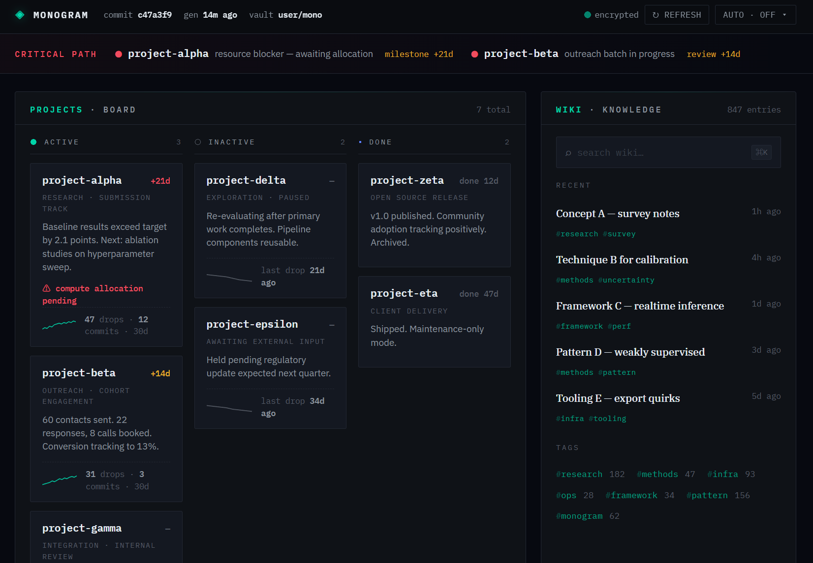

# Monogram

[English](./README.md) | 한국어

> Telegram에 보내면 자동으로 wiki에 저장, 아침엔 프로젝트 대시보드로 정리해서 보여줌

[](https://github.com/HarimxChoi/monogram/actions/workflows/tests.yml)
[](https://github.com/HarimxChoi/monogram/actions/workflows/eval.yml)
[](LICENSE)
[](https://www.python.org/downloads/)

Telegram Saved Messages에 뭐든 보내기. 링크, 생각, PDF, 사진.
5-stage LLM 파이프라인이 분류해서 private GitHub repo에 구조화된
markdown으로 atomic commit. vault는 자동으로 만들어지고, 암호화된
대시보드는 GCP에 올라감.

Commit은 Kanban으로 정리되고, 링크는 wiki가 되고, 아침엔 브리핑이 옴.
같은 vault, view 3가지: Obsidian, 대시보드, MCP로 Claude Desktop.



다크 테마, 정보 밀도 높음, 비밀번호로 보호, 클라이언트 사이드 복호화.
static bucket에서 돌리거나 (GCS 무료 티어 기준 월 $0), self-host 서버,
아니면 아예 안 돌리고 MCP-only 모드. 디자인 레퍼런스:
[docs/design/webui-mockup.html](docs/design/webui-mockup.html).


## Architecture

```
┌──────────────────────────────────────────────────────────────┐
│  INPUTS                                                      │
│    Telegram Saved Messages  ·  Obsidian plugin  ·  MCP       │
└────────────────────────┬─────────────────────────────────────┘
                         ▼
┌──────────────────────────────────────────────────────────────┐
│  PIPELINE     (5 stages · per-stage latency logged)          │
│    Orchestrator → Classifier → Extractor                     │
│                           → Verifier → Writer                │
└────────────────────────┬─────────────────────────────────────┘
                         ▼
┌──────────────────────────────────────────────────────────────┐
│  VAULT  (git)                  BACKUP  (separate PAT)        │
│    <user>/mono          ⟶      <user>/mono-backup            │
└────────────────────────┬─────────────────────────────────────┘
                         │
       ┌─────────┬───────┴───────┬────────────┐
       ▼         ▼               ▼            ▼
   Morning    Weekly         Web UI       MCP server
    brief     rollup       (dashboard)  (Claude / Cursor)

┌──────────────────────────────────────────────────────────────┐
│  OBSERVABILITY         │  EVAL HARNESS       (optional)      │
│  log/pipeline.jsonl    │  cassette replay · harvest loop     │
│  /stats · CLI          │  3-layer kill-switch                │
└──────────────────────────────────────────────────────────────┘
```

6개 horizontal plane. Inputs → pipeline → vault/backup → consumer surface.
Observability와 eval은 아래에서 cross-cutting. 전체 설명:
[docs/architecture.md](docs/architecture.md).

## Quickstart

Python 3.10+, GitHub 계정, Telegram 계정, LLM API key 1개 (Gemini 무료 티어로 충분).

```bash
pip install mono-gram
monogram init            # interactive wizard
monogram auth            # 1회 Telegram 인증
monogram run             # listener + bot (계속 실행)
```

> pip 패키지명은 `mono-gram`, CLI 명령어는 `monogram` 유지.
> Python import도 `monogram`. `from monogram import ...`.

Saved Messages에 아무거나 하나 보내기. 몇 초 안에 vault repo에 commit이 올라옴.
End-to-end walkthrough (GCP 무료 티어 → PyPI): **[deploying.md](deploying.md)**.

선택 extras:

```bash
pip install 'mono-gram[ingestion-all]'   # YouTube, arXiv, PDF, Office, HWP
pip install 'mono-gram[eval]'            # cassette-replay eval harness
```

## Web UI

Vault 1개, 대시보드 배포 방식 3가지:

| Mode | 실행 위치 | 언제 고를지 |
|---|---|---|
| **GCS** | Static bucket, 클라이언트 사이드 복호화 | 기본. Bookmarkable URL, 개인 규모 $0. |
| **Self-host** | 로컬 Flask 또는 static host | Air-gapped / private network. |
| **MCP-only** | Web 없음, Claude Desktop / Cursor로 접근 | 터미널 중심 워크플로. |

비밀번호 보호. 컨텐츠는 at rest 암호화, 호스트는 ciphertext만 보관.
Morning / weekly run 때 재생성. 설정: [docs/setup/gcp-webui.md](docs/setup/gcp-webui.md) (~5분).

## What you get

- **Atomic write (opt-in)**: `write_atomic()`가 GitHub Git Tree API로 전 경로를 단일 커밋. 기본 경로는 파일별 커밋.
- **SSRF-hardened URL ingestion**: 모든 hop 검증, CGNAT + cloud metadata range 포함.
- **Credential safety by construction**: classifier 라우팅 + writer 단계의 secret-shape redaction backstop.
- **Observability**: run당 JSONL 1줄, p50/p95/p99 on demand, Telegram `/stats`.
- **Backup isolation**: 별도 PAT + CI에서 월 1회 restore drill.
- **LLM pluggability**: Gemini / Anthropic / OpenAI / Ollama / custom, tier별.
- **Eval harness**: cassette replay (LLM 비용 0), harvest loop (기본 off)로 실제 drop에서 fixture 키움.
- **Kill-switch**: 독립적 3개 layer, first match wins.

각 항목은 [docs/](docs/)에 짧은 섹션으로 있음.

## Commands

```
run · morning · weekly · digest · search · stats
backup · mcp-serve · eval · migrate
```

상세: `monogram --help` 또는 [docs/agents.md](docs/agents.md).

## Ingestion

URL, PDF, Office doc 보내면 파이프라인 들어가기 전에 추출됨. 전체 표 +
fallback chain: [docs/ingestion.md](docs/ingestion.md). HWP는
CVE-2024-12425/12426, CVE-2025-1080 hardening 적용. [SECURITY.md](SECURITY.md) 참고.

## What this is *not*

- 챗봇 아님. 대화 turn-taking 없음.
- 검색 엔진 아님. `monogram search`는 grep + scope filter. Semantic search는 v1.1.
- Multi-user 아님. Telegram 계정 1개, vault 1개, 사람 1명.
- Obsidian/Notion/Logseq 대체 아님. Ingest path임. Vault는 어떤 markdown 에디터에서도 네이티브 렌더링.

## Roadmap

- **v0.8 (현재)**: core pipeline, ingestion, hardening, observability
- **v1.0**: dogfood + RC soak 후 PyPI 릴리즈
- **v1.1**: news digest, MCP client mode, BM25 + embeddings search

Roadmap: 릴리즈된 기능은 CHANGELOG.md 참고.

## Links

- [deploying.md](deploying.md): GCP + GitHub + LLM provider 셋업, end-to-end
- [docs/architecture.md](docs/architecture.md): 전체 topology
- [docs/agents.md](docs/agents.md): stage별 스키마 + 프롬프트
- [docs/setup/gcp-webui.md](docs/setup/gcp-webui.md): 대시보드 배포
- [docs/setup/llm-providers.md](docs/setup/llm-providers.md): provider preset config
- [docs/setup/mcp-clients.md](docs/setup/mcp-clients.md): Claude Desktop / Cursor 연동
- [docs/eval.md](docs/eval.md): eval harness + kill-switch 설계
- [SECURITY.md](SECURITY.md): threat model + 제보
- [CONTRIBUTING.md](CONTRIBUTING.md): 기여 방법

## License

MIT. [LICENSE](LICENSE) 참고.
